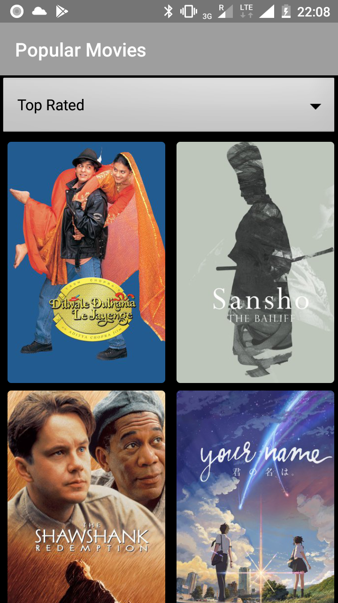
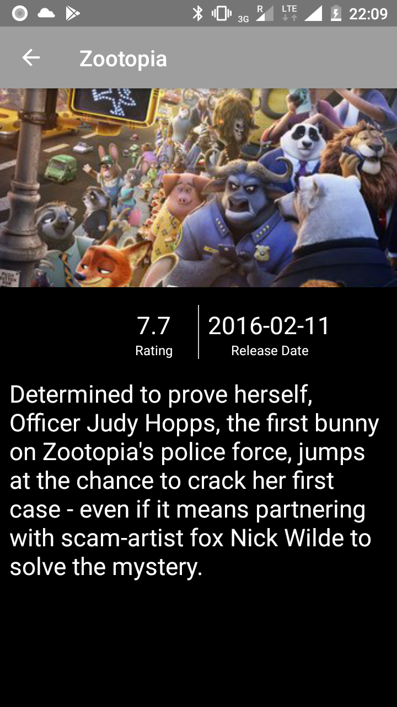
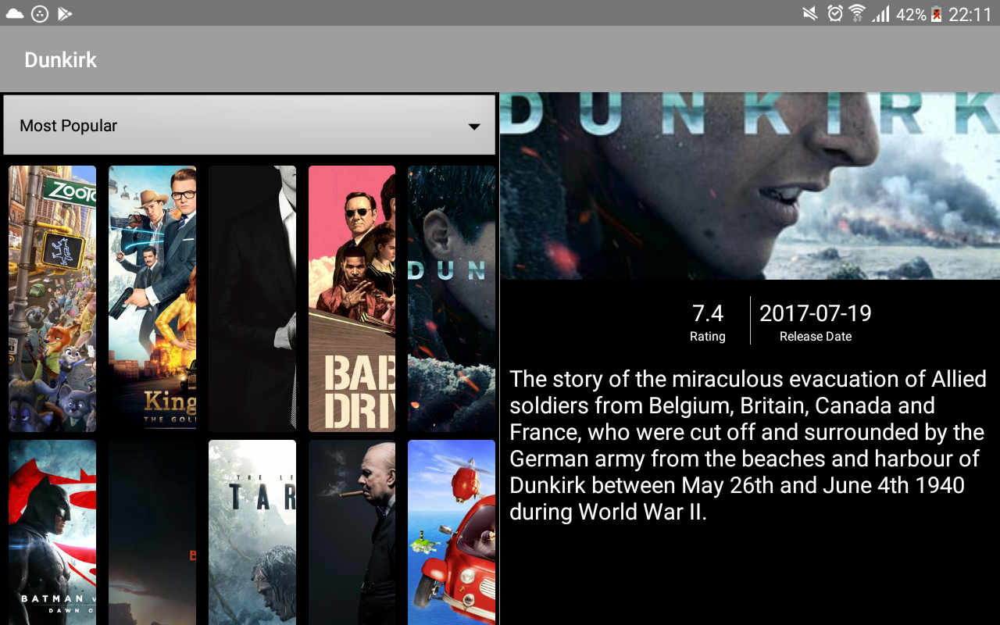

# PopularMovies1

## About 
Project 2 Udacity Android Developer Nandegree. The App queries TheMovieDb API to retrieve data using Retrofi. It is possible to sort the list by most popular and top rated movies.
To create this app, I applied Architecture Components: MVVM, Dependency Injection with Dagger 2, LiveData, DataBinding.
In addition, I added an animation when the RecyclerView is scrolled up and down and implemented a Dual Pane version for tablets.

## Screenshots
   

